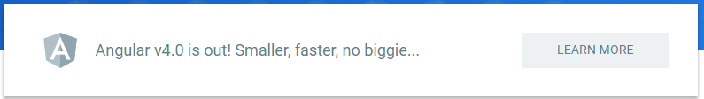
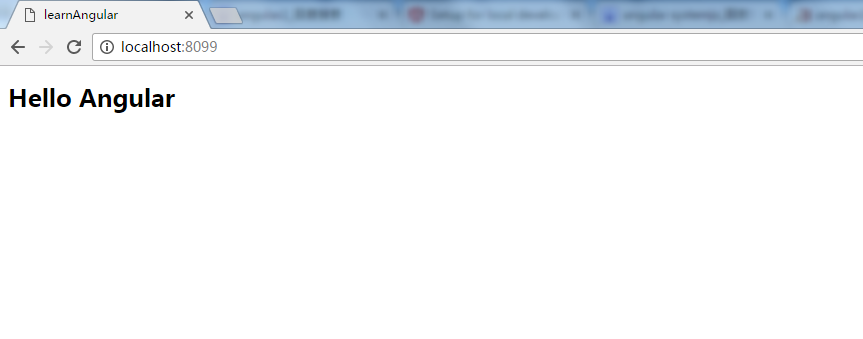
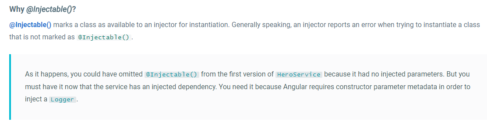
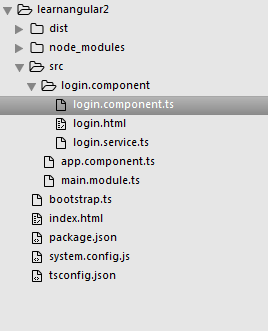
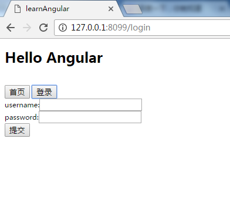
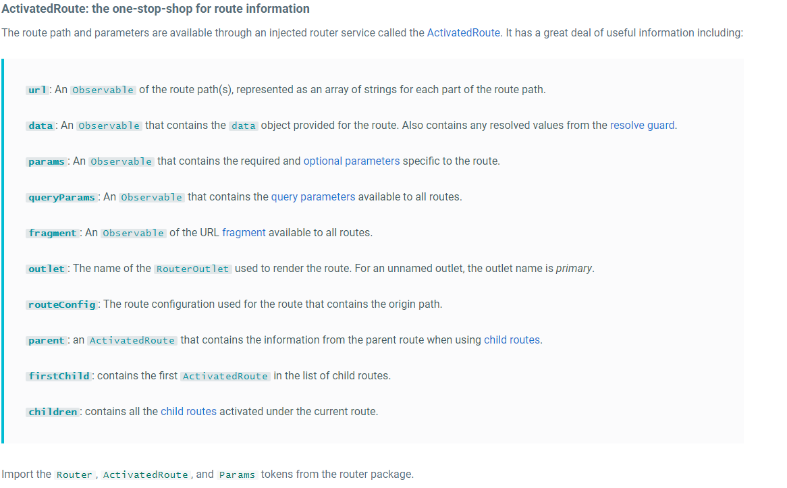
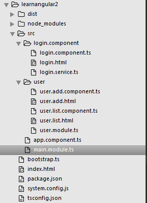

##angular4.0 入门教程

在没有发布angular3.0的情况下，angular4.0发布了，昨天查文档的时候看到官方这段字。

当时我的表情是这样的。


网上查了下，原来是因为angular.router（路由）已经到4.0而angular.js的版本才2.X。为了不让开发者在开发在下载后发现2.X的包里有个4.X的路由（router）而引起误会。于是就干脆直接发布了个4.0的整合包，其实内部除了路由（router）升级几乎没什么变化。

网上看了不少angular2的教程，不过个人觉得都写的不太仔细，所以想写个仔细点的，主要是适合我们这种菜鸟入门，呼呼~~~~

首先科普点观念先，为学习angular2的人做基础准备(心里准备)：
* angular2和angular1差异很大，这点要做好心里准备
* angular2是拥抱es6的，并且推荐的开发语法是typescript。而现在浏览器对es6的支持情况普遍不太好，所以实际开发时需要中间件来把es6的代码转到es5。
* angular2是模块化的，各个组件是独立的。而每个模块是一个或多个组件的组合


上面已经说了，angular官方建议使用typescript进行开发。当然使用js也能开发，不过语法怪异且繁琐。所以我们还是使用typescript开发(跟着官方混准没错)。

在项目之前再复习下上面的观点，目前angular的设计是基于模块(module),然后一个模块可以包含很多组件（component）。每个组件完成自己独立的功能。这样一组装就ok了。好了废话说到这，come on。


##先让我们做一个helloworld

首先我们得建立一个learnangular2文件夹来存我们的项目。

接下来使用npm来安装我们需要的组件，主要需要以下组件（按照下面的顺序依次敲命令就行了）：
```js
npm init
npm install @angular/core --save
npm install @angular/common --save
npm install @angular/compiler --save
npm install @angular/router --save
npm install @angular/platform-browser --save
npm install @angular/platform-browser-dynamic --save
npm install @angular/platform-browser-dynamic --save
npm install rxjs --save
npm install systemjs --save
npm install zone.js --save
npm install core-js --save
npm install typescript --save
```
命令敲完了，让我简单BB下上面的命令：
```js
npm init  //这个不用解释了吧，初始化一个nodejs的包管理器,一路next 默认配置就好
```
```js
npm install @angular/core --save   //这个是必备的，从文件名也能看出来是核心模块
npm install @angular/common --save  //这个是组件模块，上面也介绍了，angular是模块化的，模块里又包含组件，这个就是用来提供定义组件的模块
npm install @angular/compiler --save  //编译器，angular组件使用的
npm install @angular/router --save  //路由模块，提供给组件里使用的
npm install @angular/platform-browser --save  //用于给浏览器提供渲染等一些服务的模块,这里是静态渲染AOT
npm install @angular/platform-browser-dynamic --save //用于给浏览器提供渲染等一些服务的模块,这里是动态渲染JIT,不过它依赖与上面那个AOT模块
```
```js
npm install zone.js --save  //感觉像js的aop实现，angular/core中被引用
npm install rxjs --save   //js观察者模式的实现，angular/core中被引用
npm install systemjs --save  //SystemJS是一个通用的动态模块加载器,这里用来加载es6模块
npm install core-js --save  //一个补丁包（polyfill）用来让不支持es6的浏览器支持es6， 其实就是把es6代码转为es5
```

```js
npm install typescript --save   //typescript编译器，用于把typescript转换为es6代码
```
好了，上面就是angular的开发中几乎是必须要使用的工具了。可是你安装完后并不能直接着手开发，因为这些组件工作起来还得需要配置，主要需要配置的是typescript和system.js,暂时不解释下面配置项的含义，直接列出配置文件：

```js
//filename: tsconfig.json
//typescript默认配置文件，在使用tsc命令编译*.ts文件时，将会自动使用运行命令目录下的tsconfig.json配置文件
{
  "compilerOptions": {
    "target": "es5",
    "module": "commonjs",
    "moduleResolution": "node",
    "sourceMap": true,
    "emitDecoratorMetadata": true,
    "experimentalDecorators": true,
    "lib": [ "es2015", "dom" ],
    "noImplicitAny": true,
    "suppressImplicitAnyIndexErrors": true
  }
}
```

```js
//filename: system.config.js
//sytemjs的配置文件，配置systemjs加载时候的属性
System.config({
	paths: {
		'npm:':'/node_modules/',
		'dist:':'/dist/src/'
	},
	map : {
		'@angular/core': 'npm:@angular/core/bundles/core.umd.js',
		'@angular/common': 'npm:@angular/common/bundles/common.umd.js',
		'@angular/compiler': 'npm:@angular/compiler/bundles/compiler.umd.js',
		'@angular/platform-browser': 'npm:@angular/platform-browser/bundles/platform-browser.umd.js',
		'@angular/platform-browser-dynamic': 'npm:@angular/platform-browser-dynamic/bundles/platform-browser-dynamic.umd.js',
		'@angular/router': 'npm:@angular/router/bundles/router.umd.js',
		'@angular/router': 'npm:@angular/router/bundles/router.umd.js',
		'rxjs':'npm:rxjs'
	},
    packages: {
     'src': {
	    defaultExtension: 'js'
     },
     'dist': {
	    defaultExtension: 'js'
     },
     'node_modules': {
	    defaultExtension: 'js'
     }
    }
});
```

ok，配置文件已经被我们搞定了，终于可以开始编码了。
首先我们得添加主页文件，文件代码如下：
index.html，主页中应该要引入corejs, zonejs, systemjs, system.config.js
```html
<!-- filename: index.html -->
<!DOCTYPE html>
<html>
<head>
	<base href="/" />
	<title>learnAngular</title>
</head>
<body>
	<hello-world></hello-world>
<hello-world></hello-world>
</body>
    <script src="node_modules/core-js/client/shim.min.js"></script>

    <script src="node_modules/zone.js/dist/zone.js"></script>
    <script src="node_modules/systemjs/dist/system.src.js"></script>

    <script src="system.config.js"></script>
    <script>
      System.import('dist/bootstrap.js').catch(function(err){ console.error(err); });
    </script>
</html>
```
看的清楚点的同学可能会发现，这个页面除了引用框架包外还引入了两个文件，第一个是system.config.js，这是systemjs的配置文件。
第二个是了bootstrap.js，而目前这个文件还不存在，所以我们得添加这个js。不过别忘了我们开发语言是typescript而不是jsvascrip
所以这里添加的应该是bootstrap.ts， 编译后才会是bootstrap.js
```js
//filename: bootstrap.ts
//这里是通过system.config.js中的map中定义的@angular/platform-browser-dynamic的值是@angular/platform-browser-dynamic/bundles/platform-browser-dynamic.umd.js
import { platformBrowserDynamic } from '@angular/platform-browser-dynamic';
//这里可以看到这个dist:这个东西是在system.config.js中paths里面定义的,结合定义的组合起来就是/dist/main.module,再加上我们在packages中定义了在dist文件夹下默认后缀为.js所以就找到文件了
import { MainModule } from 'dist:main.module';

platformBrowserDynamic().bootstrapModule(MainModule);

```
这个文件是用来启动angular主模块的。
源码中可以看到bootstrap.ts中引入了其他的JS，但是我们页面中也没加载。那么引入的js是怎么自动加载的呢？就是通过systemjs这个模块加载器去加载啦。


接下来我们在根目录下创建一个src目录，用来保存我们开发的源码
先添加bootstrap中的主模块,（再说一遍angular是基于模块的哟）
```js
//filename: main.module.ts
import { NgModule }      from '@angular/core';
import { BrowserModule } from '@angular/platform-browser';
import { AppComponent } from 'dist:app.component';

@NgModule({
  //主模块需要依赖的模块列表
  imports:      [ BrowserModule ],
  //主模块需要使用的component, angular中组件和模块就是在这里进行关联的
  declarations: [ AppComponent ],
  exports:      [ AppComponent ],
  //主模块启动后第一个启动的组件
  bootstrap:    [ AppComponent ]
})
export class MainModule { }
```
好的，主模块写完了，可以看到主模块中在declarations配置项中引用了AppComponent


最后再添加AppComponent组件，在angular中，具体的业务逻辑是写在组件中的
```js
//filename: app.component.ts
import { Component } from '@angular/core';
//定义了一个组件,在主页的body中使用<hello-world></hello-world>进行访问
@Component({
  selector: 'hello-world',
  template: `<h1>Hello {{name}}</h1>`
})
export class AppComponent { name = 'Angular'; }
```
最后，我们再在根目录下添加一个dist文件夹，用来保存编译后的文件

好了，当文件添加完毕后，我们的目录看起来应该像这样:

没问题的话，我们在根目录（learnangular2）中使用
`tsc --rootDir . --outDir dist` 把当前目录下的所有ts编译到dist目录下
命令来编译目录下的所有ts文件(这里子目录也会被编译哟)。
注意：如果在编译过程中有类始于 Cannot find module ....之类的错误，可以先选择无视。

编译完成后使用浏览器打开(请注意这里打开应该使用网页服务器而不是右键打开)。打开后看起来应该是这样的。

一个hello angular就被搭建起来了，是不是很简单？


##接下里说说路由的事

angular2中升级了很多angular1的东西，比如内置路由可以嵌套了，模块可以懒加载了。
我们先把我们的项目简单修改下，为我们的项目增加登陆组件，在打开页面时，让用户第先登录。

不过在这之前，得给大家介绍几个知识点方便后面的理解：
1.Templates
   angular中的template,基本上它和html还是没什么差距，不过去掉了script标签，因为这个标签在模版中是不安全的。另外，一些语义化标签在模版中也是不推荐使用的，比如html,body,base,meta。等标签。
   模版插值和angular1相同，在模版中使用双花括号`{{表达式}}`,如：
   ```html
	<h3>
    	{{title}}
    	
	</h3>
   ```
2.annotation
   angular2 中的依赖配置现在全部依赖于注解，比如刚开始的@componnent注解,@ngModule注解,这些元信息表述了angular将会如何处理这个类，关于注解在官方文档是这样描述的：
   
   不过得给大家说明除了上面一系列的注解angular会自动注入外，标明@injectable()这个注解的类也会自动注入：
   
	可以这么说，上面的@component， @ngModule 等注解是 @injectable 的子类

OK， 现在我们在根目录再增加一个子目录，longin.component,这里放登录相关的组件，既然是组件，我们则需要下面几个文件：
login.component.ts       //登录组件定义
login.html				//登录页面
login.service.ts		//登录使用的service

老规矩，我们贴上这几个文件的代码：
```js
//filename: login.component.ts

import { Component } from '@angular/core';
import { LoginService } from 'dist:login/login.service';

@Component({
  templateUrl: '/src/login.component/login.html', //声明登录模版路径
  providers:  [ LoginService ]	//声明需要提供的类
})
export class LoginComponent {
	//在构造器中声明我们需要注入的类
	 constructor(service: LoginService) {
		this.service = service;
	 }
	public login = function(username, password) {
		if(this.service.login(username, password)) {
			alert('成功')
		} else {
			alert('登录错误')
		}
	}
}
```
上面的组件中，引入了LoginService, 在构造函数中，我们申明了一个`service: LoginService`参数，它告诉angular,在初始化的时候给我提供一个LoginService的实例，我们又把实例赋值给`this.service`方便以后访问


```html
//filename: login.html

<div> 注意input中的#un写法，这表示声明input元素的一个引用变量(可以认为就是个dom元素的引用变量)，可以在这个模版中任意地方使用，比如提交按钮中，我们使用了 un.value 这些写法来获得他们的值, 还有登录按钮事件的写法(click),和标准写法on-click没有任何区别
<div>
<div>
	<div><label>username:</label><input #un type="input" name="username"></div>
	<div><label>password:</label><input #pd type="input" name="username"></div>
	<div><input type="button" name="login" (click)="login(un.value, pd.value)" value="提交"></div>
</div>
```


```js
//filename: login.service.ts

import { Injectable } from '@angular/core';

//angular会对此注解提供注入,也就是如果你这个service需要其他的东西，有这个标记的话angular就会自动注入进来啦
@Injectable()
export class LoginService {
  public login(username:string, password:string):boolean   {
  	console.log('login:' + username + password);
  	if('mrzhang' === username && '123456' == password){
  		return true;
  	}
  	return false;
  }
}
```

好了，新文件添加完毕，不过我们还得改造下老的文件，因为还没添加路由呢.我们改造下main.module

```js
//filename: main.module.ts
import { NgModule }      from '@angular/core';
import { BrowserModule } from '@angular/platform-browser';
import { RouterModule, Routes } from '@angular/router';

import { AppComponent } from 'dist:app.component';
import { LoginComponent } from 'dist:login.component/login.component';

//注意这里的路由声明
const appRoutes: Routes = [
  { path: 'login', component: LoginComponent },
  { path: 'index', component: LoginComponent },
  { path: '**', component: LoginComponent }
];

//将声明的路由添加到模块中
@NgModule({
  imports:      [ BrowserModule , RouterModule.forRoot(appRoutes, {userHash:true})],
  declarations: [ AppComponent, LoginComponent],//这里我们还使用到了登录模块
  exports:      [ AppComponent ],
  bootstrap:    [ AppComponent ]
})
export class MainModule { }
```
上面声明的路由中包含login和index两个路径，不过处理这两个路径的组件都是LoginComponent，所以实际上没任何区别,请注意最后一个路由，它的路径是`**`,它的意思是匹配其他没被定义的路由。


最后修改下helloword组件的模版，在helloword模版中增加两个导航按钮
```html
<button routerLink="index">首页</button>
<button routerLink="login">登录</button><br>
<router-outlet></router-outlet>
```
导航按钮中，使用了`routerLink`指令来用于跳转URL


ok.,修改完毕后看起来应该像下面这个样子
```js
//filename: app.component.ts
import { Component } from '@angular/core';

@Component({
  selector: 'hello-world',
  template: `<h1>Hello {{name}}</h1><br>
		  <button routerLink="index">首页</button>//routerLink 点击跳转链接
		  <button routerLink="login">登录</button><br>
		  <router-outlet></router-outlet>`//相当于angular1 ui-router中的 <ui-view>标签
})
export class AppComponent { name = 'Angular'; }
```

由于新增加了一系列文件,现在目录看起来是这样的：

好了，命令行再运行`tsc --rootDir . --outDir dist`编译下吧.打开浏览器看成果吧，现在可以验证登录了



###最后谈谈模块的异步加载吧
angular2中原生就支持异步模块加载，现在我们再增加一个用户管理模块，有两个页面，一个添加用户，一个用户列表。
首先我们在src下创建文件夹user,用来存放user模块的文件。user模块下有两个组件，一个是添加用户组件，一个用户列表组件。另外有一个user主模块文件。
所以user文件夹下应该有以下几个文件：
user.module.ts
user.add.component.ts
user.add.html
user.list.component.ts
user.list.html
首先写主模块
```js
import { NgModule }      from '@angular/core';
import { BrowserModule } from '@angular/platform-browser';
import { RouterModule, Routes } from '@angular/router';
import { FormsModule } from '@angular/forms';

import { UserListComponent } from 'dist:user/user.list.component';
import { UserAddComponent } from 'dist:user/user.add.component';


const appRoutes: Routes = [
  { path: '', redirectTo: 'list', pathMatch: 'full'},
  { path: 'list', component: UserListComponent },
  { path: 'add', component: UserAddComponent },
];


@NgModule({
  imports:      [ FormsModule, RouterModule.forChild(appRoutes, {useHash:true})],
  declarations: [ UserListComponent, UserAddComponent]
})
export class UserModule { }
```
在user的主模块中我们注册了三个路由，这很好理解,模块中引入了两个组件UserListComponent和UserAddComponent,它们分别处理list和add访问路径，
值得注意的是其中有一个路由的path为空。它的意思是当访问的路径为空时，重新定向到list路由。

好的，接下来我们来看user.add.component
```js
import { Component } from '@angular/core';
import { Router} from '@angular/router';

@Component({
  templateUrl: '/src/user/user.add.html',
})
export class UserAddComponent {
	public add = function(username, password) {
		 this.router.navigate(['/user/list', this.user]);
	}

	constructor(private router:Router) {
		this.user = this.user || {};
	}
}
```
在用用户添加组件中，我们提供了一个add方法用于页面上的添加按钮响应事件，还提供了一个构造函数，在构造函数中我们初始化了user这个对象.
在这里还使用了路由提供的js跳转方法 navigate([uri, param]), 它的参数是个数组，第一个是要跳往的URI，第二个是跳转时传递的参数.

值得一提的是，add函数中使用的`this.router`大家可能发现好像没有定义，其实它是在构造函数中的参数定义的：
```js
constructor(private router:Router) {
}
//相当于
constructor(router:Router) {
	this.router = router;
}
//这两个构造函数唯一的差距只是少了个private
```

>什么是构造函数？
>简单的理解就是当UserAddComponent这个组件在内存中初始化时，第一执行的就是构造函数。也就是这个函数无论如何将会是第一个调用的，

ok，在看看user.list.component.ts,其实这个组件很简单，只是简单的展示了下怎么接收参数：
```js
import { Component } from '@angular/core';
import { Router, ActivatedRoute, Params } from '@angular/router';

@Component({
  templateUrl: '/src/user/user.list.html',
})
export class UserListComponent {
	public user = '';

	constructor(route:ActivatedRoute) {
		this.user = route.snapshot.params['name'];
	}
}
```
angular2中提供了一个最简单的参数接收方式,就是使用route.snapshot.params来接收你的参数，关于更多的参数信息参照下图



不过个人觉得最好的还是route.snapshot.params,因为它最简单.
好的，最后是两个组件分别对应的HTML
```html
filename: user.add.html
<div><button routerLink="/user/add">添加用户</button><button routerLink="/user/list">用户列表</button></div>
<div>这里时用户添加页面</div>
<form  >
	<div><label>username:</label><input [(ngModel)]="user.name" type="text" name="a"></div>
	<div><label>password:</label><input [(ngModel)]="user.pw" type="text" name="b"></div>
	<div><label>submit:</label><input on-click='add()' type="button" name="" value="提交"></div>
</form>
<div>username:{{user.name}}, pw:{{user.pw}}</div>
```
这个页面中，我们使用了双向绑定，在angular2中[]这样的绑定是用于绑定输入，()这样的是用于绑定输出,所以双向绑定就是[()]再结合ngModel指令啦,
值得一提的是，这里提交按钮的事件我们并没有采用`(click)='add()'`而是采用的标准写法喔`on-click='add()'`

```html
filename: user.list.html
<div><button routerLink="/user/add">添加用户</button><button routerLink="/user/list">用户列表</button></div>
<div>这里是用户列表页面</div>
<div>你刚刚添加了一个用户 {{user}}</div>
```
好了，最后一步，我们得在我们原来的主路由中添加一个路径，当登录成功后跳转到我们user模块中的路径中。

```js
//filename: main.module.ts
import { NgModule }      from '@angular/core';
import { BrowserModule } from '@angular/platform-browser';
import { RouterModule, Routes } from '@angular/router';

import { AppComponent } from 'dist:app.component';
import { LoginComponent } from 'dist:login.component/login.component';


const appRoutes: Routes = [
 { path: '', redirectTo: 'login', pathMatch: 'full'},
  { path: 'login', component: LoginComponent },
  { path: 'index', component: LoginComponent },
  { path: 'user', loadChildren: 'dist:/user/user.module#UserModule' },
];


@NgModule({
  imports:      [ BrowserModule ,  RouterModule.forRoot(appRoutes, {useHash:true})],
  declarations: [ AppComponent, LoginComponent],
  exports:      [ AppComponent ],
  bootstrap:    [ AppComponent ]
})
export class MainModule { }
```

在上面我们可以看到，当用户访问user路径时，load一个子模块(loadChildren),子模块的字符串采用`#`号分割,第一部分为模块定义的路径，第二部分为模块的定义名称。
这样，当我们访问user路径时，angular就会去加载user模块了，user模块加载成功后，由于没有指定要访问的path，所以第一个就会打开定义为''的那个path
现在我们的文件目录应该是这样：

好的，现在可以添加用户了，试试吧
...
点击这里下载源码learnangular

###写在后面的
前面的例子我们演示了angular2中的模块定义，组件定义，路由定义，路由懒加载，以及路由的参数传递。可以看出来的是angular现在确实是越来越复杂了，也越来越工程化了。个人觉得还是可以学习和尝试的。


