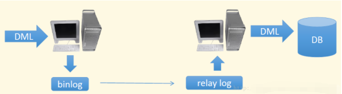

### mysql主从配置详解与读写分离方案
 首先主从配置和读写分离是两个东西；主从配置是读写分离的基础；这篇文章重在讲解实践过程。
 
#### 主从配置
主从配置主要是解决以下单独数据服务器的缺点：
- 效率低；单台肯定比不上多台啊
- 抗灾性能差；就是数据没有备份

##### 以前解决方案是：

* 多台机器同时使用，数据自己写代码去同步
* 程序定时备份数据库，对数据库得压力也大

一切以不给程序猿增加工作量的原则；mysql官方就推出了主从模式；
简单来说这个就是通过配置主从后，mysql来帮你把主数据库的数据同步到从数据库；
简单解释下同步的原理：**mysql所有操作都是可以生成日志文件的**，当你启用主从模式后，主库会把你所有的增删改查记录到日志中，然后从库会去拿这个日志文件，再根据日志来进行数据回演；这样所有的数据就生成到从库。



这里我们先讲主从配置；要做主从配置首先要满足以下条件：
- 两台单独的服务器，并且能相互访问
- 最好安装相同版本的mysql

好的，现在我们准备如下两台主机：
```js
10.1.1.195	windows	master
10.1.1.130	ubantu	slave
```
接下来按照标准步骤安装mysql到两台服务器上；完毕后启动mysql；测试是否能成功链接；

现在开始配置；根据刚刚讲解的原理，我们要做以下配置：
* 子服务器是通过父服务器日志文件进行数据重演的，那么父服务器需要开启某种日志记录；
* 子服务器需要到主服务器上拉日志文件；那么子服务器就需要一个账号；

好的，现在我们首先开启主库的二进制数据日志记录，打开主库的my.ini增加以下字段：
```js
[mysqld]
log-bin=mysql-bin-master  #启用二进制日志
server-id       = 1   #本机数据库ID ;注意：从库的server-id一定要大于主库，也就是说从库的server-id只能>=1
#binlog-do-db=HA   #可以被从服务器复制的库。二进制需要同步的数据库名，可以不配置
#binlog-ignore-db=mysql  #不可以被从服务器复制的库, 可以不配置
```

好的，接下来我们给从库创建一个用于拉去日志文件的账号，root连接到主库，执行以下sql：
```sql
grant replication slave on *.* to 'slave'@'10.1.1.130' identified by "slave1";

#grant all privileges on *.* to 'slave'@'%' identified by 'slave1';

```
第一条意思是创建一个名为slave，密码是slave1的账号，这个账号只能从10.1.1.130这个IP登陆；这个账号有replication slave，这两个权限；
第二条意思是创建一个名为slave，密码是slave1的账号，这个账号可以从任意IP登陆；这个账号有所有权限；
选一条就行

好了，现在主库已经配置好了。重新启动mysql服务器；并把数据库备份出来；
**经常数据备份是很重要的**；
root连接到主库，执行下列sql命令查看主库状态：
```sql
mysql> show master status;
+-------------------------+----------+--------------+------------------+
| File                    | Position | Binlog_Do_DB | Binlog_Ignore_DB |
+-------------------------+----------+--------------+------------------+
| mysql-bin-master.000001 |      259 | HA           | mysql            |
+-------------------------+----------+--------------+------------------+
```
上面的file字段和position字段是重要的，后面会用到;

接下来配置从库，第一步也是编辑从库的配置文件:
```js
[mysqld]
server-id = 2   #本机数据库ID ;注意：从库的server-id一定要大于主库
```
从库不用记录操作日志文件，所以只用增加一个server-id就行了；
接下来重启从库并root连接上去,先把主库的备份数据导入到从库；
然后执行以下sql再从库中添加主库信息：
```sql
change master to
master_host='10.1.1.195', #主库的服务器地址
master_user='slave', #创建用于拉取日志文件的账号
master_password='slave1', #密码
master_log_file=' mysql-bin.000001', #上面的file字段的值
master_log_pos= 295 #上面的Position字段的值
```

配置完毕后就可以启动从库了；启动执行：
```sql
start slave;
```
这样从库就启动成功了，使用下面命令查看是否启动成功：
```sql
show slave status /G;
```
注意查看返回结果，其中部分字段应该如下返回：
```js
Slave_IO_Running: Yes
Slave_SQL_Running: Yes
...
Last_IO_Error:0
Last_SQL_Error:0
```
这样的话，就配置成功了，你可以去操作你的主库，创建个数据库或者插入语句，然后到从库去看看。

上面的配置值得一提的是，如果重新启动mysql服务那么file和position的值会变化，你应该更改从库的主库配置；更改流程如下：
- 首先使用`stop slave` 停止从库
- 使用`reset slave` 重置从库
- 使用`change master to...`重新设置主库信息
- 使用`start slave`启动从库

接下来列举一些导致失败的原因：
- 关闭防火墙或则添加规则，避免从库被墙而拿不到日志文件
- mysql文件编辑时注意，别写错了，写错了启动不起来
- 更改配置后需要重新启动mysql服务

### 好了，主从配置将完了，接下来说说读写分离
有了主从配置，现在我们可以把数据放到10个20个服务器上面，那么这么多库除了备份数据还能有其他作用吗？所有的操作都还再主数据库中，并发流量大了主服务器还不是炸了，所以跟着主从库连着一起有出来了读写分离；
读写分离很好理解，一般从库用于读，主库用于写；
一般读写分离的解决方案有以下几种：
- 自己编码解决
- 使用中间件，也就是第三方提供的程序解决

##### 自己写代码解决
自己写代码解决方案不太推荐，因为前期还好，后期随着代码和数据规模大了后，添加数据源，或者更换数据源策略就不好弄了。
##### 使用第三方中间件
使用第三方是一个比较好的方法，现在成熟的中间件有以下几个，感兴趣的自己baidu
- mysql-proxy,mysql官方提供了
- Amoeba，阿里开源的一款，现在用于项目中


