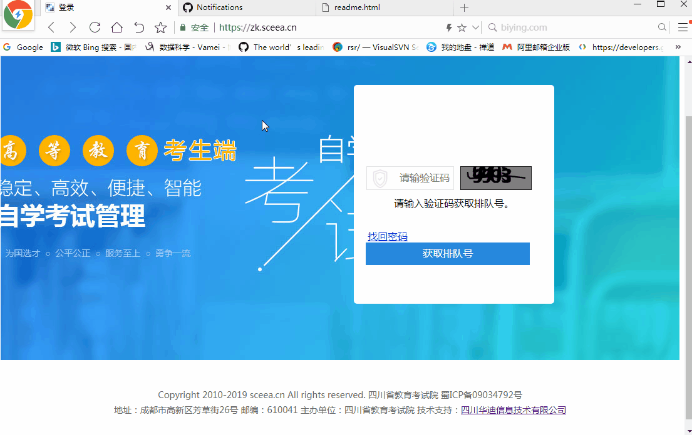

### 自考跳过排队教程

[官方报名地址:https://zk.sceea.cn](https://zk.sceea.cn) 点击可以直接跳转

由于该自考报名网站是个垃圾网站, 所以大家遇到操作不顺利的,就刷新重头开始,从登陆开始!

任何操作超过1分钟没反应;请从登陆重新开始！
任何觉得不应该出现的场景请从登陆重新开始！


##### 报名顺序: 登陆 -> 切换准考证 -> 报考, 切记不能乱

#### 推荐使用火狐(firefox)浏览器或者谷歌(chrome)浏览器

### 1.步骤简介
1. 打开调试窗口
	1. 所有浏览器都支持按 F12 直接打开;如F12不能直接打开再使用2/3方法手动打开;
	2. chrome打开方式为: 网页单击鼠标右键 -> 选择检查 -> 切换到 console 选项卡 -> 贴入代码
	3. Firefox打开方式为: 网页单击鼠标右键 -> 选择查看元素 -> 切换到 控制台 选项卡 -> 输入 allow pasting -> 贴入代码
2. 贴入代码并回车
3. 登陆


### 2.代码
``` javascript
window.dv_get_order_number.style.display="none";window.dv_login_body.style.display="block";
```


### 3.动图演示



### 4.如果大家觉得不错,不要忘了点赞； 或者如果此方法失效,可以联系我qq:80921006